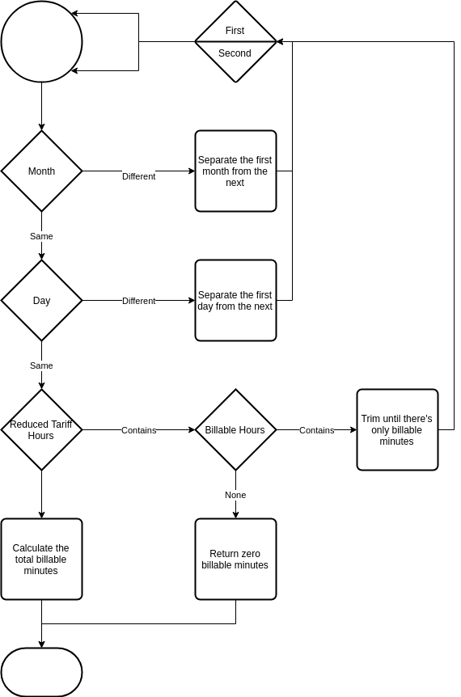

# ChargeManager

The **ChargeManager** uses the data stored in a database to calculate the charges for calls.

## getBillableMinutes

This method receives two datetime objects and uses the object internal data to return the quantity of billable minutes in a call. It currently only implements the *initialTime > finalTime* path, or put simply, only if the reduced tariff aplies from one day to the next.

Implemented with recurssion, it first bissects the call time in smaller, continuous chunks. rightMiddleTime is defined either as the first day of the month, or the first minute of the day. With rightMiddleTime and leftmiddleTime being one second apart from each other.



```python
Charge.objects.latest('enforced')
```
This database acces query is common in this implementation, reading the latest value tables. It gives asyncronous capabilities to this class and a possobility to a prices history.

```python
if finalTime.month != initialTime.month:
    rightMiddleTime = finalTime.replace(
        day=1, hour=0, minute=0, second=0, microsecond=0)
    _delta = finalTime - rightMiddleTime
    leftmiddleTime = finalTime - _delta - timedelta(seconds=1)
    return ChargeManager.getBillableMinutes(initialTime, leftmiddleTime) + ChargeManager.getBillableMinutes(rightMiddleTime, finalTime)
```

```python
elif finalTime.day != initialTime.day:
    rightMiddleTime = finalTime.replace(
        hour=0, minute=0, second=0, microsecond=0)
    _delta = finalTime - rightMiddleTime
    leftmiddleTime = finalTime - _delta - timedelta(seconds=1)
    return ChargeManager.getBillableMinutes(initialTime, leftmiddleTime) + ChargeManager.getBillableMinutes(rightMiddleTime, finalTime)

```

If the function is called within the same day, it trimms off the start and finish of the reduced tariff period or returns 0 billable minutes if the call is completely within the reduced tariff period.

```python
elif finalTime.day == initialTime.day:
    # if the tariff pass from onde day to the next, (1) and (2) will complement each other and return only the billable minutes
    if Charge.objects.latest('enforced').reduced_tariff_end < Charge.objects.latest('enforced').reduced_tariff_start:
        # it started at midnight and the previous day is treated in a different recursion
        if(finalTime.hour < Charge.objects.latest('enforced').reduced_tariff_end):
            return 0
        # it will end at midnight and the next day is treated in a different recursion
        elif(initialTime.hour >= Charge.objects.latest('enforced').reduced_tariff_start):
            return 0
        # I will start counting at the end of the reducedTariff (1)
        elif(initialTime.hour < Charge.objects.latest('enforced').reduced_tariff_end):
            _initialTime = initialTime.replace(
                hour=Charge.objects.latest('enforced').reduced_tariff_end, minute=0, second=0, microsecond=0)
            return ChargeManager.getBillableMinutes(_initialTime, finalTime)
        # It will stop counting at the start of the reducedTariff (2)
        elif(initialTime.hour >= Charge.objects.latest('enforced').reduced_tariff_end and finalTime.hour >= Charge.objects.latest('enforced').reduced_tariff_start):
            _finalTime = finalTime.replace(
                hour=Charge.objects.latest('enforced').reduced_tariff_start, minute=0, second=0, microsecond=0) - timedelta(seconds=1)
            # the plus 1 is to compensate the timedelta
            return ChargeManager.getBillableMinutes(initialTime, _finalTime) + 1

```

After everything is prepared, it simply returns the total continous minutes in the call.

```python
deltaSeconds = finalTime - initialTime
billableMinutes = int(deltaSeconds.total_seconds() / 60)

return billableMinutes
```

## getCharge

The most important method, it calls the other methods and returns the value of the call.

```python
def getCharge(self, initialTime, finalTime):
    initialTime = ChargeManager.formatTime(initialTime)
    finalTime = ChargeManager.formatTime(finalTime)

    billableMinutes = self.getBillableMinutes(initialTime, finalTime)
    charge = self.standingCharge + billableMinutes * self.minuteCharge
    return int(charge * 100) / 100
```

## formatTime

This method receives either a datetime object, a floating point or int timestamp, or a string formated in the ISO standard and returns a datetime object. *It was used in a previous implementation and was kept for compatibility.*

```python
    def formatTime(time):
        if type(time) is float:
            time = datetime.datetime.fromtimestamp(time)
        if type(time) is int:
            time = datetime.datetime.fromtimestamp(float(time))
        if type(time) is str:
            time = dateutil.parser.parse(time)
        if type(time) is not datetime.datetime:
            raise TypeError("Types must be either datetime ,float(timestamp) or an ISO string.")
        return time
```
